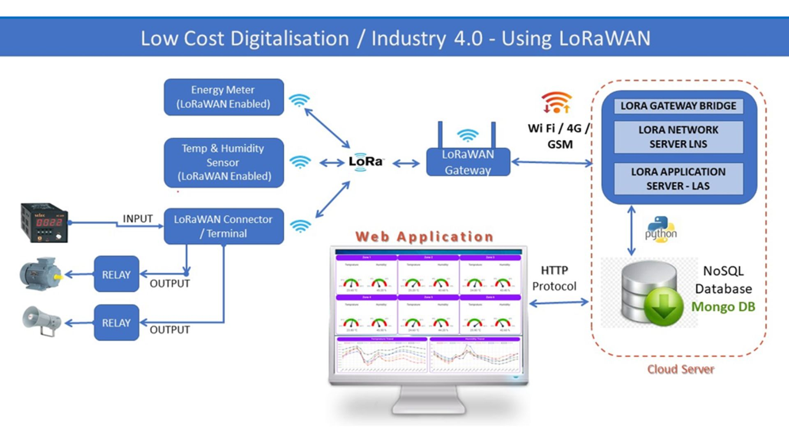

# LoRaWAN IoT Temperature Humidity Monitoring System

It is a wireless sensor-based system that uses LoRaWAN technology to monitor temperature and humidity in various environments. This system is suitable for applications in various industries, including food storage, pharmaceuticals, and environmental monitoring.

The system consists of <b>wireless sensors that are placed at different locations to monitor temperature and humidity levels</b>. The sensors transmit data to a LoRaWAN gateway that collects and forwards the data to a cloud-based platform. The platform stores and processes the data, allowing users to monitor the temperature and humidity levels in real-time and receive alerts if the levels go beyond the specified limits.

● Tech Stack: C++, Python, Node.Js, Pandas, MongoDB, Linux(Ubuntu), Next.JS & LoRaWAN Technology

Overall, a LoRaWAN IoT Temperature Humidity Monitoring System is an excellent solution for industries that require accurate and real-time monitoring of temperature and humidity levels to ensure the quality and safety of their products.

## Architecture

A LoRaWAN IoT temperature and humidity monitoring system architecture typically consists of the following components:

End Devices: These are small sensors that are attached to the object or environment that needs to be monitored. They collect data on temperature and humidity levels and transmit it to the gateway.

Gateway: The gateway is responsible for receiving the data from the end devices and forwarding it to the network server.

Network Server: The network server manages the LoRaWAN network and is responsible for routing the data from the gateway to the application server.

Application Server: The application server receives the data from the network server and processes it. It stores the data in a database and provides a user interface to view and analyze the data.

User Interface: The user interface is typically a web-based dashboard that allows users to view the temperature and humidity data in real-time, set thresholds for alerts, and generate reports.

Cloud Storage: Cloud storage is used to store the data collected by the sensors for long-term analysis and historical reporting.

Overall, the architecture of a LoRaWAN IoT temperature and humidity monitoring system is designed to be scalable, low-power, and cost-effective, making it suitable for use in a wide range of industrial, commercial, and residential applications.

## Industry Different Zones- Comparison of Temperature & Humidity

## Current Temperature & Humidity in all Zones

## All Data Entries

## Day Wise Trend of Particular Zone

## Used By

This project is used by the following companies:

- Magneti Marelli India

## Author - Apoorva Verma

- [Linkedin](https://www.linkedin.com/in/apoorva-verma-aa045a202/)
- [Resume Website](https://apoorva-verma.netlify.app/)
- [Github](https://github.com/apoorva-01/)

