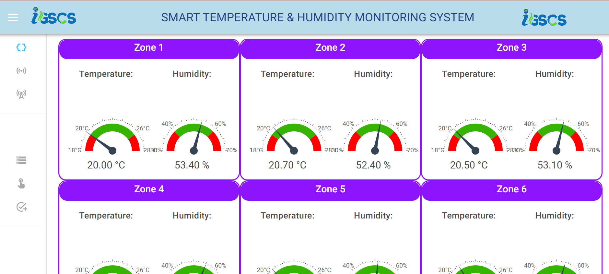
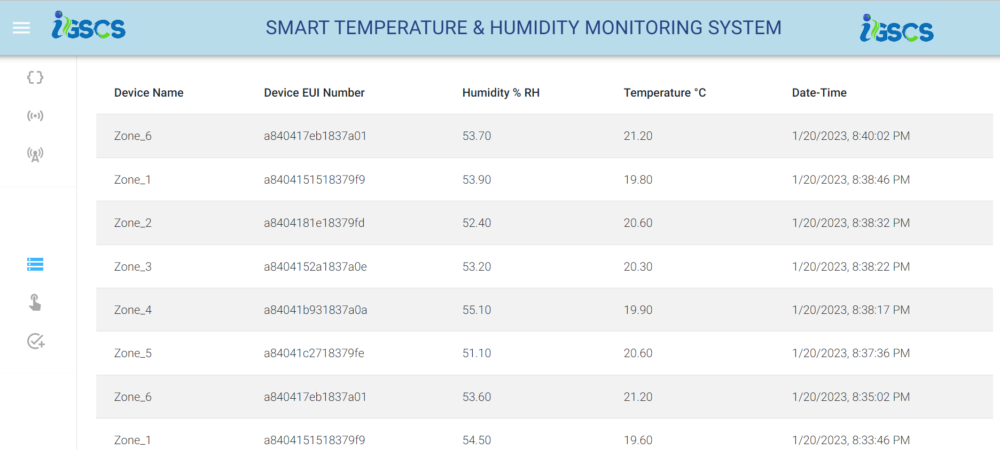
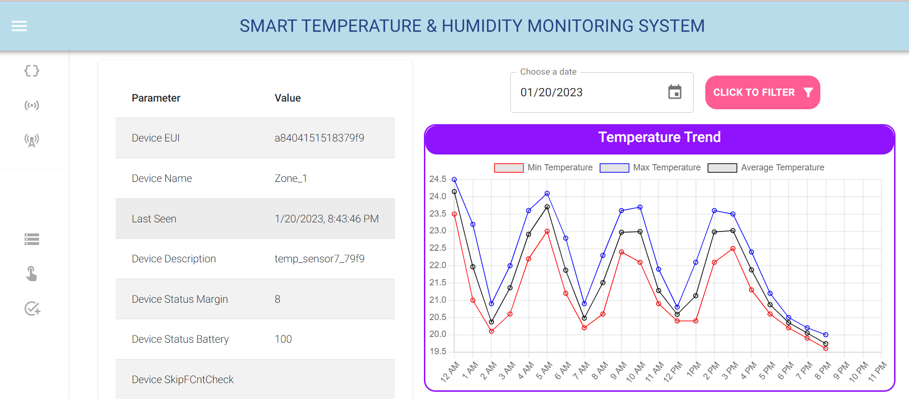

# IOT Application for Industry Digitalization & Automation

Collect all metrics of machines running in the industry for early error detection, energy saving, and actuating next steps based on
sensor data collected.

● Tech Stack: C++, Python, Node.Js, Pandas, MongoDB, Linux(Ubuntu), Next.JS & LoRaWAN Technology

## Industry Different Zones- Comparison of Temperature & Humidity

## Current Temperature & Humidity in all Zones

## All Data Entries

## Day Wise Trend of Particular Zone

## Used By

This project is used by the following companies:

- Magneti Marelli India

## Author - Apoorva Verma

- [Linkedin](https://www.linkedin.com/in/apoorva-verma-aa045a202/)
- [Resume Website](https://apoorva-verma.netlify.app/)
- [Github](https://github.com/apoorva-01/)

