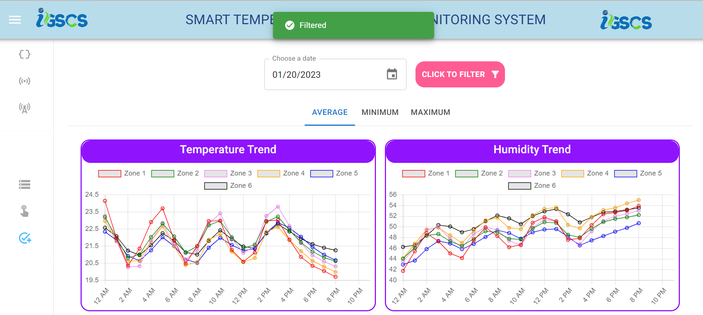

# LoRaWAN IoT Temperature Humidity Monitoring System

It is a wireless sensor-based system that uses LoRaWAN technology to monitor temperature and humidity in various environments. This system is suitable for applications in various industries, including food storage, pharmaceuticals, and environmental monitoring.

The system consists of wireless sensors that are placed at different locations to monitor temperature and humidity levels. The sensors transmit data to a LoRaWAN gateway that collects and forwards the data to a cloud-based platform. The platform stores and processes the data, allowing users to monitor the temperature and humidity levels in real-time and receive alerts if the levels go beyond the specified limits.

● Tech Stack: C++, Python, Node.Js, Pandas, MongoDB, Linux(Ubuntu), Next.JS & LoRaWAN Technology

## Industry Different Zones- Comparison of Temperature & Humidity

## Current Temperature & Humidity in all Zones

## All Data Entries

## Day Wise Trend of Particular Zone

## Used By

This project is used by the following companies:

- Magneti Marelli India

## Author - Apoorva Verma

- [Linkedin](https://www.linkedin.com/in/apoorva-verma-aa045a202/)
- [Resume Website](https://apoorva-verma.netlify.app/)
- [Github](https://github.com/apoorva-01/)

